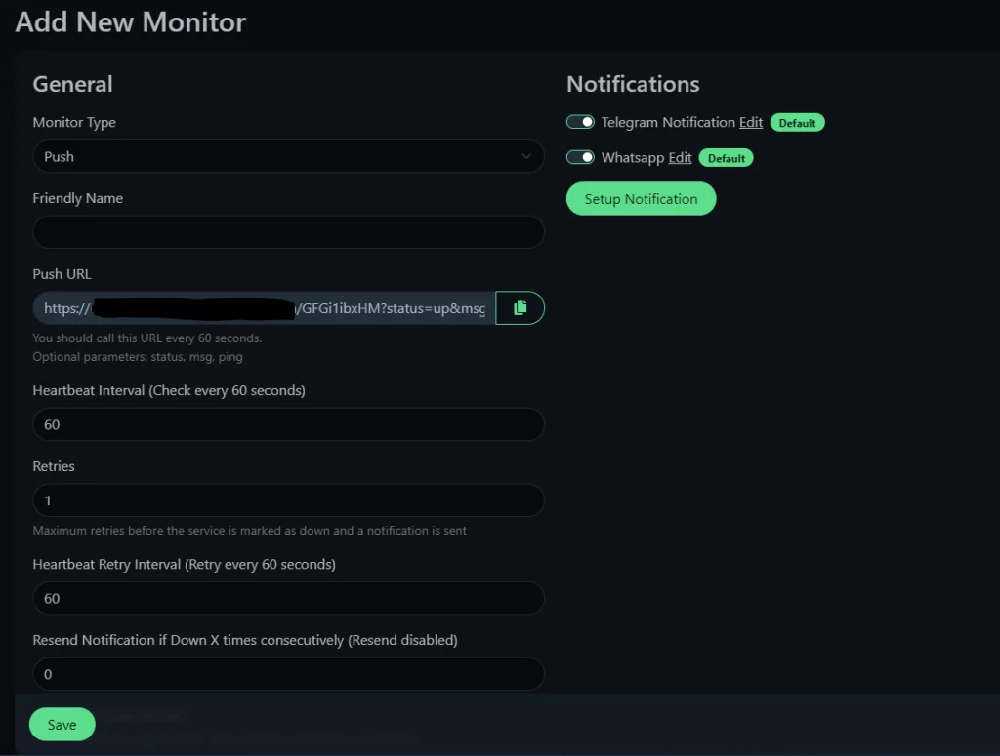

# Uptimekuma-agent
**"Uptime Kuma"** is an open-source status monitoring tool designed to keep an eye on various services and systems. It provides a web-based interface for visualizing the status of monitored services, making it easier for administrators and users to check the health and performance of their systems.

## Key features of Uptime Kuma may include:

* **Web Interface:** Uptime Kuma typically offers a user-friendly web interface where you can view the status of monitored services.

* **Service Monitoring:** It allows you to monitor the status of different services, servers, or websites.

* **Alerts:** Uptime Kuma often comes with alerting capabilities, notifying administrators or users when there's a service disruption or downtime

* **Historical Data:** The tool may also store historical data, allowing you to review the performance of your services over time.

* **Customization:** Depending on the version and updates, Uptime Kuma might offer customization options for configuring monitoring parameters.


#### "Push" monitor in Uptime Kuma typically refers to a monitoring mechanism where the monitored service actively pushes its status updates to the Uptime Kuma server. This is in contrast to the more traditional "Pull" method, where the monitoring system periodically checks the status of services by making requests.

In a "Push" monitoring setup with Uptime Kuma:

* **Monitored Service:** The service being monitored actively sends status updates to the Uptime Kuma server.

* **Uptime Kuma Server:** Uptime Kuma receives and processes these status updates from the monitored services.

* **Real-time Monitoring:** With the "Push" method, Uptime Kuma can receive real-time updates about the status of services, enabling quicker detection of issues or outages.

* **Reduced Polling Load:** Unlike the "Pull" method, where the monitoring system repeatedly polls services for their status, the "Push" method reduces the need for frequent requests, potentially lowering the overall load on both the monitoring system and the monitored services.

## Using the push (passive) monitor
To configure the monitor, click on the upper left side on '+ Add New Monitor' and define the following details:



* **Monitor Type:** Choose "Push."
* **Friendly Name:** Display name.
* **Push URL:** This field should contain the URL that needs to be configured in the remote agent. Through this URL, the system will be updated.
* **Heartbeat Interval:** The time interval Uptime Kuma will expect to pass between interactions with the agent.

Click on Save to save the settings.

To define the container that will send a push to the Uptime Kuma server, create a file named docker-compose.yaml and paste the following code snippet into it:

```yaml
version: "3.7"

services:
  uptimekuma_agent:
    image: techblog/uptimekuma_agent
    container_name: uptimekuma_agent
    environment:
      - PUSH_URL= #Uptime Kuma passive push url
      - PUSH_INTERVAL=50 #Interval between pings in seconds. Default is set to 50 seconds.
```

### In this configuration:

* **PUSH_URL:** Specifies the URL to which the container should send the update (the Push URL obtained during the monitor setup).

* **PUSH_INTERVAL:** Represents the time between calls to the Push URL. You can replace 50 with your desired interval in seconds.

Make sure to customize the values according to your specific requirements, and then save the updated docker-compose.yaml file. After that, you can deploy and run the container using Docker Compose.


