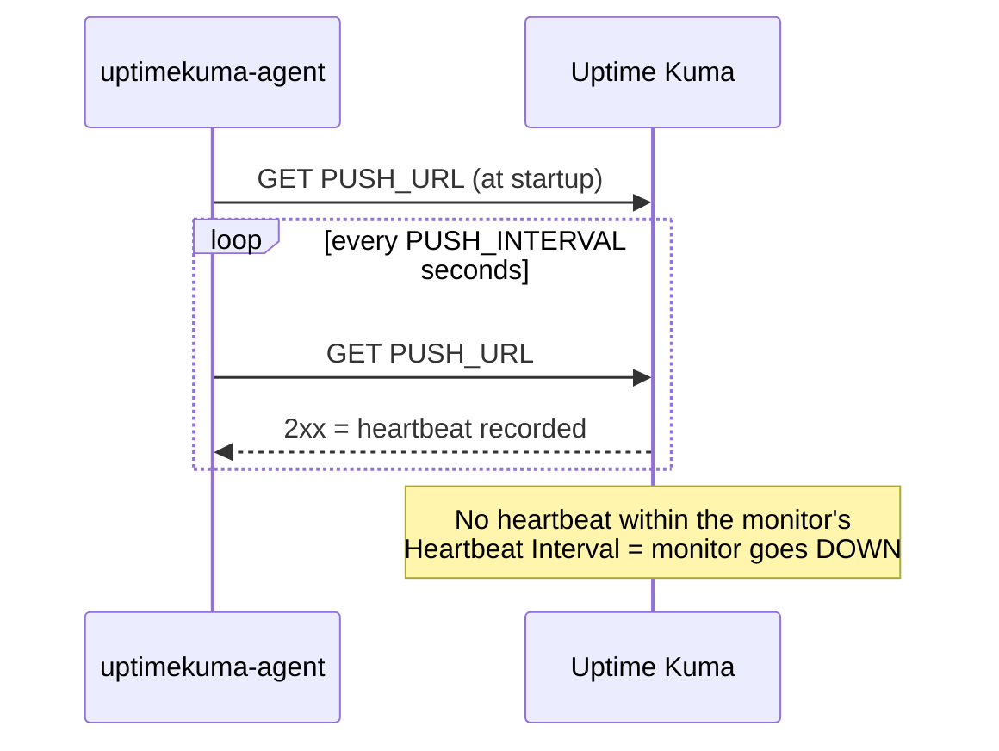

# uptimekuma-agent

[](LICENSE)

A tiny Docker container that keeps an [Uptime Kuma](https://github.com/louislam/uptime-kuma)
**Push** (passive) monitor alive. It calls the monitor's Push URL at startup and then on a fixed
interval. If the host, the container, or its network path goes down, the heartbeats stop and
Uptime Kuma marks the monitor as down and sends its notifications.

Use it to watch machines and networks that Uptime Kuma cannot reach directly: hosts behind NAT
or a firewall, remote sites, or anything where an outbound HTTPS call is easier than an inbound
check.

## Table of contents

- [Features](#features)
- [How it works](#how-it-works)
- [Requirements](#requirements)
- [Set up the Push monitor in Uptime Kuma](#set-up-the-push-monitor-in-uptime-kuma)
- [Installation](#installation)
- [Configuration](#configuration)
- [Logs and health check](#logs-and-health-check)
- [Troubleshooting](#troubleshooting)
- [Security notes](#security-notes)
- [Development](#development)
- [Contributing](#contributing)
- [License](#license)

## Features

- Sends an HTTP `GET` to your Uptime Kuma Push URL once at startup, then every `PUSH_INTERVAL`
  seconds (default `50`).
- Per-request timeout (`REQUEST_TIMEOUT`, default `10` seconds), so a hung connection cannot
  stall the schedule.
- Treats any non-2xx response as a failure and logs it.
- Exits with a clear error when `PUSH_URL` is not set.
- Verifies TLS certificates on HTTPS Push URLs.
- Runs as an unprivileged user (UID `10001`) on `python:3.12-slim-bookworm`.
- Configured entirely through three environment variables.

## How it works


```mermaid
sequenceDiagram
    participant Agent as uptimekuma-agent
    participant Kuma as Uptime Kuma
    Agent->>Kuma: GET PUSH_URL (at startup)
    loop every PUSH_INTERVAL seconds
        Agent->>Kuma: GET PUSH_URL
        Kuma-->>Agent: 2xx = heartbeat recorded
    end
    Note over Kuma: No heartbeat within the monitor's<br/>Heartbeat Interval = monitor goes DOWN
```

Uptime Kuma has two kinds of monitors. Most monitors **pull**: Uptime Kuma sends a request to
the target on a schedule. A **Push** monitor works the other way round: it waits for the
monitored side to call a unique URL, and marks the monitor as down when those calls stop
arriving within the configured Heartbeat Interval.

This agent is the "monitored side" of a Push monitor:

- It uses `PUSH_URL` **exactly as you give it**. It does not build the URL or add query
  parameters. Uptime Kuma's Push URL already carries `status`, `msg` and `ping` parameters
  (for example `?status=up&msg=OK&ping=`), and they are sent unchanged.
- It is a pure heartbeat. It does **not** measure latency, fill in the `ping` parameter, or check
  any local service. It never reports `status=down` itself; "down" is detected by Uptime Kuma
  when the heartbeats stop.
- A failed push is logged and **not retried**. The next attempt is the next scheduled one, so a
  single transient error only costs one heartbeat.

## Requirements

- A running Uptime Kuma instance with a Push monitor (see below).
- Outbound HTTP(S) access from the agent to that instance.
- Docker (or Docker Compose), or Python 3 with `pip` to run from source. The image uses
  Python 3.12.

## Set up the Push monitor in Uptime Kuma

In Uptime Kuma, click **+ Add New Monitor** and fill in:


- **Monitor Type:** `Push`.
- **Friendly Name:** a display name.
- **Push URL:** generated by Uptime Kuma. Copy it with the copy button; this is the value for
  `PUSH_URL`. It has the form `https://<your-kuma-host>/api/push/<push-token>?status=up&msg=OK&ping=`.
- **Heartbeat Interval:** how long Uptime Kuma waits for a push before it counts a missed
  heartbeat. Set `PUSH_INTERVAL` **lower** than this value (the defaults, 50 s against
  Uptime Kuma's 60 s, already fit).

Click **Save**.

## Installation

> [!IMPORTANT]
> **Published image status (checked 2026-09-30).** The workflows and `docker-compose.yaml` use
> the image `techblog/uptimekuma_agent`, but that repository does **not exist on Docker Hub
> yet**, and nothing is published on GHCR. The only published image is the older
> `techblog/uptimkuma-agent` (note the spelling) with tags `latest` and `1.0.0`
> (`linux/amd64`, `linux/arm64`, pushed 2023-07-29). It predates the request timeout,
> response check and non-root user described here.
>
> Until the new image is published, build it locally under the expected name. The Compose and
> `docker run` examples below then work unchanged:
>
> ```bash
> git clone https://github.com/t0mer/uptimekuma-agent.git
> cd uptimekuma-agent
> docker build -t techblog/uptimekuma_agent .
> ```

### Docker Compose

Create a `docker-compose.yaml` (the repository ships the same file, see the note below):

```yaml
services:
  uptimekuma_agent:
    image: techblog/uptimekuma_agent
    container_name: uptimekuma_agent
    restart: unless-stopped
    environment:
      - PUSH_URL=https://kuma.example.com/api/push/<push-token>?status=up&msg=OK&ping=
      - PUSH_INTERVAL=50
```

```bash
docker compose up -d
docker compose logs -f uptimekuma_agent
```

The repository's `docker-compose.yaml` leaves `PUSH_URL` empty on purpose; fill it in before you
start it. Its inline comment (`PUSH_URL= #Uptime Kuma passive push url`) is a YAML comment, so
if you leave the value empty the agent starts with no URL and exits. `restart: unless-stopped`
is a recommendation and is not in the shipped file.

### docker run

Quote the URL: it contains `&`, which the shell would otherwise interpret.

```bash
docker run -d \
  --name uptimekuma_agent \
  --restart unless-stopped \
  -e PUSH_URL='https://kuma.example.com/api/push/<push-token>?status=up&msg=OK&ping=' \
  -e PUSH_INTERVAL=50 \
  techblog/uptimekuma_agent
```

### From source (without Docker)

```bash
git clone https://github.com/t0mer/uptimekuma-agent.git
cd uptimekuma-agent
pip install -r requirements.txt
PUSH_URL='https://kuma.example.com/api/push/<push-token>?status=up&msg=OK&ping=' \
PUSH_INTERVAL=50 \
python3 app/app.py
```

Runtime dependencies (pinned in `requirements.txt`): `requests`, `schedule`, `loguru`.

## Configuration

All settings are environment variables. There are no command-line flags or config files.

| Variable | Required | Default | Description |
|---|---|---|---|
| `PUSH_URL` | Yes | empty | The full Push URL copied from the Uptime Kuma monitor, including its query string. Leading and trailing whitespace is stripped. If empty, the agent logs `PUSH_URL is not set. Exiting.` and exits with code `1`. |
| `PUSH_INTERVAL` | No | `50` | Seconds between pushes, as a whole number. The first push happens immediately at startup. Keep it below the monitor's Heartbeat Interval. |
| `REQUEST_TIMEOUT` | No | `10` | Timeout in seconds for each push request, as a whole number. Not set in the image, so the code default applies. |

`PUSH_INTERVAL` and `REQUEST_TIMEOUT` must be integers; a value such as `30s` or `1.5` makes the
agent fail at startup with a Python `ValueError`.

## Logs and health check

The agent logs to stderr through [loguru](https://github.com/Delgan/loguru)'s default handler and
emits only INFO and ERROR messages. View the logs with
`docker logs uptimekuma_agent`. Typical lines:

| Message | Meaning |
|---|---|
| `Starting agent` / `Sensor URL: ...` | Startup; the configured URL is echoed. |
| `Pinging ...` | A push is being sent. |
| `Push succeeded (200)` | Uptime Kuma accepted the heartbeat. |
| `Error updating sensor.` followed by details | The push failed: timeout, DNS or connection error, TLS error, or a non-2xx response. |
| `PUSH_URL is not set. Exiting.` | `PUSH_URL` is missing or empty. |

The image defines a Docker `HEALTHCHECK` (every 60 s) that only confirms `app.py` is still
running as PID 1. It does **not** check whether pushes succeed: a container can be `healthy`
while every push fails. Use the logs, or the monitor itself in Uptime Kuma, to confirm heartbeats
arrive.

## Troubleshooting

- **The container exits right after starting.** `PUSH_URL` is empty. Check that the variable is
  set and not swallowed by a YAML comment. When running from source, an unquoted `&` in the URL
  also leaves it empty.
- **`docker run` fails without creating a container.** The URL was not quoted, so the shell split the
  command at `&`. Wrap the whole `-e PUSH_URL=...` value in single quotes.
- **`Error updating sensor.` with a 404 or other 4xx status.** The URL is wrong, or the push
  token belongs to a monitor that was deleted or paused. Copy the Push URL again from Uptime Kuma.
- **`Error updating sensor.` with a certificate / SSL error.** TLS verification is always on. Use
  a certificate trusted by the container's CA bundle. For a private CA, `requests` honours the
  `REQUESTS_CA_BUNDLE` environment variable; mount your CA file and point the variable at it.
- **Timeouts.** The Uptime Kuma host is unreachable from the agent, or slower than
  `REQUEST_TIMEOUT`. Check DNS, firewall and proxy settings from the agent's host.
- **The monitor flaps between up and down.** `PUSH_INTERVAL` is too close to (or above) the
  monitor's Heartbeat Interval. Lower `PUSH_INTERVAL` or raise the Heartbeat Interval.
- **`ValueError` at startup.** `PUSH_INTERVAL` or `REQUEST_TIMEOUT` is not a whole number.
- **`docker compose up` / `docker run` cannot pull the image.** The Docker Hub image is not
  published yet; build it locally (see [Installation](#installation)).

## Security notes

- **The push token is a secret.** Anyone who has the Push URL can mark your monitor as up. Keep
  it out of version control; prefer an `.env` file or a secret store over hard-coding it in a
  committed Compose file.
- **The agent logs the full Push URL**, including the token, at startup and on every push. Treat
  container logs as sensitive, or restrict who can read them.
- **Use HTTPS** for the Push URL so the token is not sent in clear text.
- **Keep TLS verification on.** The agent has no option to disable it; fix certificate problems
  with a trusted certificate or CA bundle instead.
- The container runs as the unprivileged user `appuser` (UID `10001`), needs no ports, volumes or
  extra capabilities, and only makes outbound requests to `PUSH_URL`.

## Development

Project layout:

```
app/app.py            # the agent
Dockerfile            # python:3.12-slim-bookworm, non-root user, HEALTHCHECK
docker-compose.yaml   # example deployment
requirements.txt      # pinned runtime dependencies
VERSION               # image version used by the Docker Hub and JCR workflows (currently 1.1.0)
screenshots/          # README images
```

Build and run locally:

```bash
docker build -t techblog/uptimekuma_agent .
docker run --rm -e PUSH_URL='https://kuma.example.com/api/push/<push-token>?status=up&msg=OK&ping=' techblog/uptimekuma_agent
```

There is no test suite or linter configuration in the repository.

### CI workflows

All three workflows are started manually (`workflow_dispatch`). None of them runs on push or
creates git tags or GitHub Releases.

| Workflow | File | Image | Tags | Platforms | Secrets |
|---|---|---|---|---|---|
| Docker Build | `.github/workflows/docker-image.yml` | `techblog/uptimekuma_agent` (Docker Hub) | `latest`, contents of `VERSION` | `linux/amd64`, `linux/arm64` | `DOCKERHUB_USERNAME`, `DOCKERHUB_TOKEN` |
| JCR Docker Build | `.github/workflows/docker-jcr.yml` | `<JCR registry>/docker/uptimekuma-agent` (private JFrog Container Registry; host taken from the `JCR_URL` secret) | `latest`, contents of `VERSION` | `linux/amd64`, `linux/arm64` | `JCR_URL`, `JCR_USERNAME`, `JCR_TOKEN` |
| Publish to GHCR | `.github/workflows/publish-ghcr.yml` | `ghcr.io/t0mer/uptimekuma_agent` | the `tag` input (default `latest`), plus `latest` | `linux/amd64`, `linux/arm64`, `linux/arm/v7` | built-in `GITHUB_TOKEN` |

To release a new version, update `VERSION`, then run the workflows from the repository's
**Actions** tab.

## Contributing

Issues and pull requests are welcome. Keep changes small, describe what you tested, and make sure
the image still builds with `docker build .`.

## License

Released under the [MIT License](LICENSE). Copyright (c) 2023 Tomer Klein.
